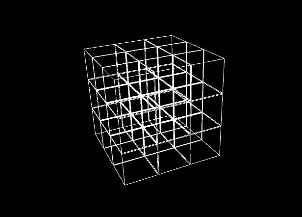
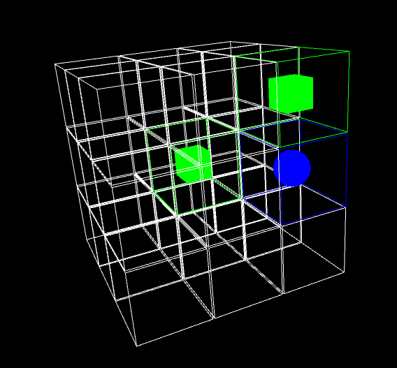
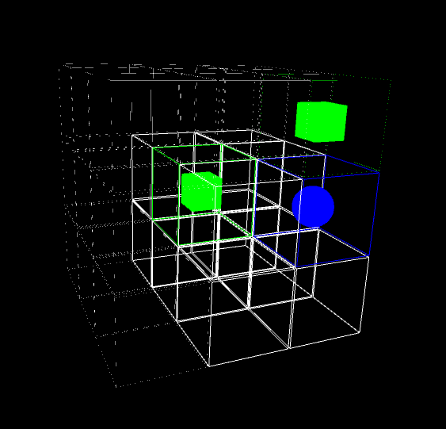
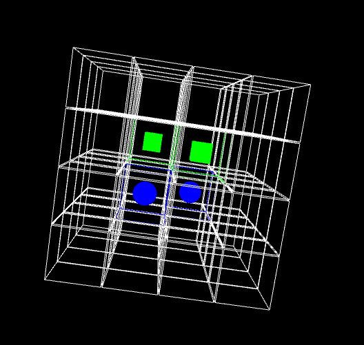

# XOXO_cube
  
Program napisany w Javie w środowisku graficznym Processing.  
Aby go skompilować wymagane jest środowisko.  
Aplikacja używa bibloteki PeasyCam do płynnego poruszania kamerą.  
  
Program nie posiada żadnego okna do ustawiania parametrów takich jak  
wielkość sześcianu na którym toczy się gra, czy ilości zaznaczeń  
w rzędzie potrzebnych do wygranej, więc trzeba to ustawić w kodzie przed kompilacją.  

Używanie programu:  
-Obwódka wokół ekranu (nie widoczna na poniższych screenach)  
sygnalizuje turę danego gracza - zielonego (krzyżyk/kostka), niebieskiego (kółko/kula)  
-Sześcian obraca się za pomocą myszki.  
-Aby wybrać komórkę do zaznaczenia należy na nią kliknąć  
i potwierdzić wybór spacją, wtedy następuje runda drugiego gracza  
sygnalizowana zmienioną obwódką ekranu .  
-Aby uzyskać dostęp do komórek znajdujących się wewnątrz sześcinu,  
należy użyć klawiszy W,S,A,D,Q,E do ukrywania poszczególnych rzędów komórek,  
co widać na przykładzie nr.3.
  
Przykłady:  
  
 
 
  
